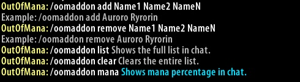
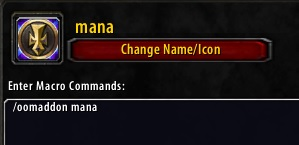

# OutOfMana
Vanilla WoW Addon

### How to install ###

Download as zip, extract the folder "OutOfMana-master" to [YourWowDirectory]/Interface/Addons.  
**Rename said folder to "OutOfMana", if you don't do this the addon won't load properly**.

### How it works ###

The addon keeps track of a players names list wich is saved and reused everytime you log in and out.  
For convenience the *entire* list (as of today) of <Intoxicated> healers are loaded by default the first time you use this addon.  
This list can be eddited manually using the commands showed below.  

### Usage ###

Type "/oomaddon help" in chat to get the commands list.

Instead of typing out "/oomaddon mana" every time you want to check the mana percetange you can make a macro like the following:

